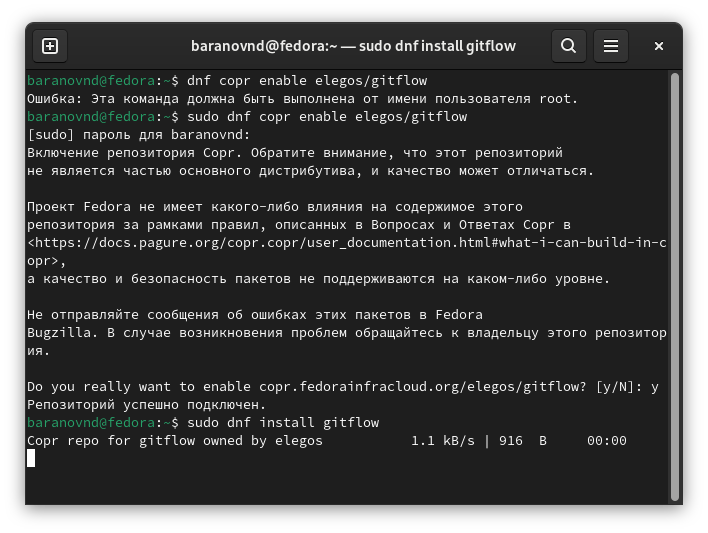
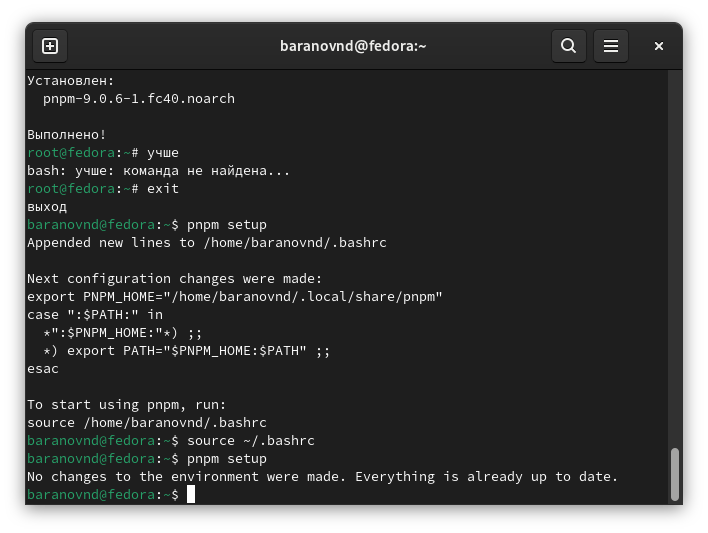
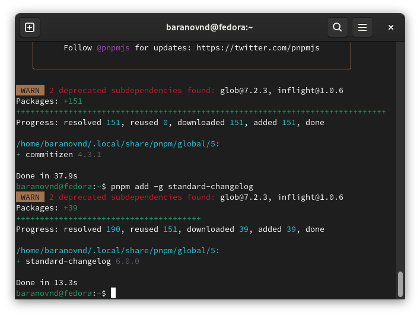
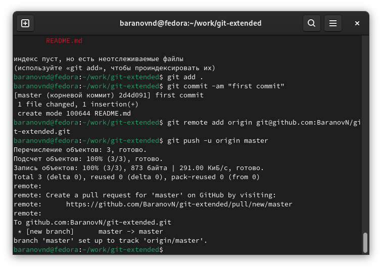
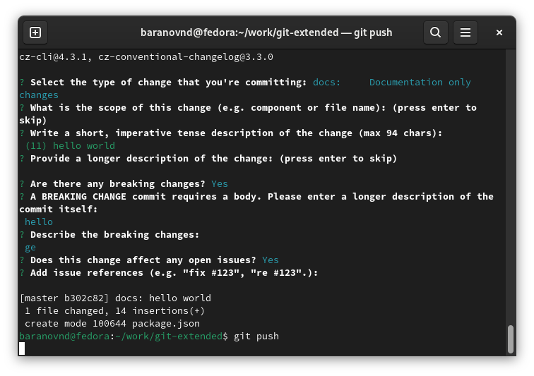
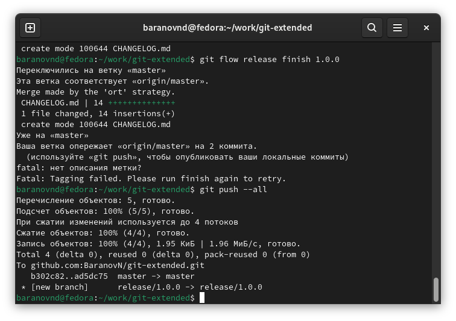
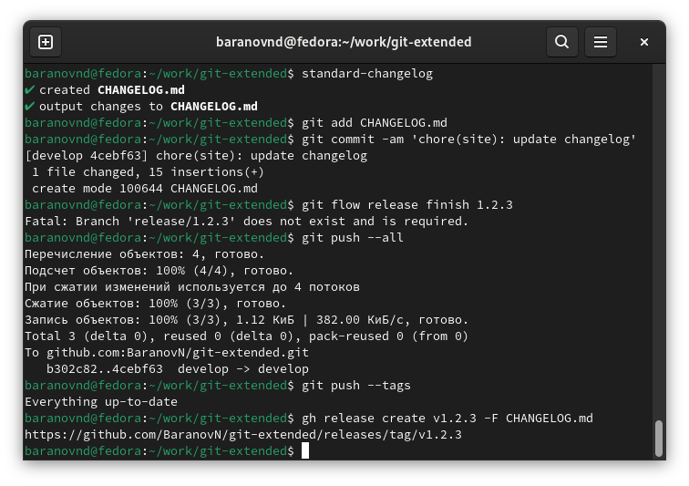

---
## Front matter
lang: ru-RU
title: Лабораторная работа №4
subtitle: Продвинутое использование git
author:
  - Баранов Н.Д
institute:
  - Российский университет дружбы народов, Москва, Россия

## i18n babel
babel-lang: russian
babel-otherlangs: english

## Formatting pdf
toc: false
toc-title: Содержание
slide_level: 2
aspectratio: 169
section-titles: true
theme: metropolis
header-includes:
 - \metroset{progressbar=frametitle,sectionpage=progressbar,numbering=fraction}
---

# Информация

## Докладчик

:::::::::::::: {.columns align=center}
::: {.column width="70%"}

  * Баранов Никита Дмитриевич
  * студент
  * Российский университет дружбы народов
  * [1132242977@pfur.ru](mailto:1132242977@pfur.ru)
  
:::
::: {.column width="30%"}

:::
::::::::::::::

# Выполнение лабораторной работы

# Установка git-flow и настройка Node.js. Общепринятые коммиты

## Устанавливаем git-flow и Node.js

:::::::::::::: {.columns align=center}
::: {.column width="30%"}

:::
::::::::::::::

## Устанавливаем pnpm

:::::::::::::: {.columns align=center}
::: {.column width="30%"}

:::
::::::::::::::

## Устанавливаем для помощи в создании логов

:::::::::::::: {.columns align=center}
::: {.column width="30%"}

:::
::::::::::::::

# Создание репозитория git

## Делаем первый коммит и выкладываем на гитхаб

:::::::::::::: {.columns align=center}
::: {.column width="30%"}

:::
::::::::::::::

## Добавляем в json команду и пушим изменения

:::::::::::::: {.columns align=center}
::: {.column width="30%"}

:::
::::::::::::::

## Создаем релиз 1.0.0 и пушим

:::::::::::::: {.columns align=center}
::: {.column width="30%"}

:::
::::::::::::::

# Работа с репозиторием

## Создаем релиз 1.2.3 и пушим

:::::::::::::: {.columns align=center}
::: {.column width="30%"}

:::
::::::::::::::

## Вывод

- Мы получили навыки работы с репозиториями git
